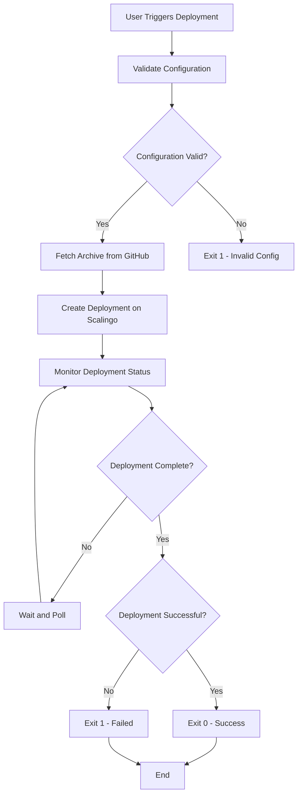

# `scalingo_deployer`

## Description

**scalingo_deployer** is a powerful tool designed to streamline and manage deployments to the Scalingo PaaS provider. It enables users to trigger deployments using specific Git references and control the deployment process through environment variables. The tool integrates with GitHub repositories, making it an essential utility for automating and monitoring your Scalingo-based applications' deployments.

## Documentation

Complete API documentation is available at: [GitHub.io](https://betterplace.github.io/scalingo_deployer/github.com/betterplace/scalingo_deployer/)

## Building `scalingo_deployer`

### Prerequisites
- Ensure you have Go installed (version 1.25 or later).
- Install Docker if you plan to build within a container.

### From Source

1. **Clone the Repository**
   ```bash
   git clone https://github.com/yourusername/scalingo_deployer.git
   cd scalingo_deployer
   ```

2. **Set Up Dependencies and Build**
   ```bash
   make setup build
   ```
   - `setup`: Downloads Go dependencies.
   - `build`: Compiles the `scalingo_deployer` binary.

3. Run Tests to ensure everything is working correctly, you can run the tests:
   ```bash
   make test
   ```

### Using Docker

1. **Build the Docker Image**
   ```bash
   make build
   ```
   This command builds a Docker image with `scalingo_deployer`.

2. **Display Build Information**
   ```bash
   make build-info
   ```
   This will echo the remote tag for the Docker image, which you can use to
   identify and retrieve the newly built image from your container registry after
   pushing changes.

## Usage

The deployment tool is designed to be run as a Docker container and supports deployment to Scalingo PaaS through environment variables.

### Docker Usage

On semaphore CI for example:

```bash
docker run
  -e SCALINGO_APP
  -e GITHUB_OWNER_REPO=$SEMAPHORE_GIT_REPO_SLUG
  -e GIT_REF=$SEMAPHORE_GIT_SHA
  -e GITHUB_API_TOKEN=$GITHUB_API_TOKEN
  -e SCALINGO_API_TOKEN=$SCALINGO_API_TOKEN
  gcr.io/betterplace-183212/scalingo_deployer
```

### Environment Variables

The **scalingo_deployer** tool uses several environment variables to configure its behavior. These variables are parsed and validated at runtime, allowing for flexible and dynamic deployment configurations.

#### Core Configuration

- `GITHUB_OWNER_REPO`:
  GitHub repository in the format `"owner/repo"`.

- `GIT_REF`:
  The Git reference to deploy (e.g., branch name, tag, or commit hash).

- `GITHUB_API_TOKEN`:
  API token for authenticating with GitHub.

- `SCALINGO_API_ENDPOINT`:
  The Scalingo API endpoint to use. Defaults to `https://api.osc-fr1.scalingo.com`.

- `SCALINGO_APP`:
  The name of the Scalingo app to deploy.

- `SCALINGO_API_TOKEN`:
  The Scalingo API token to use.

## Exit Codes

The tool uses the following exit codes to indicate the outcome of operations:

- `0`: Success
- `1`: Failure

## Example Workflow

### Triggering a Deployment Using `scalingo_deployer`

The deployment workflow follows this process:

1. **Configuration Validation**: The tool validates all required environment variables
2. **Archive Retrieval**: It fetches the source code archive from GitHub using the provided token
3. **Deployment Initiation**: It creates a deployment on Scalingo using the retrieved archive
4. **Monitoring**: The tool continuously polls Scalingo for deployment status
5. **Result Handling**: Based on the deployment outcome, it exits with appropriate status codes (0 for success, 1 for failure)

This workflow ensures coordinated deployments while maintaining the ability to track deployment progress through Scalingo's API.



Run the `scalingo_deployer` command with the required environment variables:

```bash
GITHUB_OWNER_REPO=betterplace/betterplace
GIT_REF=main
GITHUB_API_TOKEN=your-github-token
SCALINGO_APP=your-scalingo-app
SCALINGO_API_TOKEN=your-scalingo-token

docker run \
  -e GITHUB_OWNER_REPO \
  -e GIT_REF \
  -e GITHUB_API_TOKEN \
  -e SCALINGO_APP \
  -e SCALINGO_API_TOKEN \
  gcr.io/betterplace-183212/scalingo_deployer
```

- **Parameters Explained**:
  - `GITHUB_OWNER_REPO=betterplace/betterplace`: Specifies the GitHub repository involved in the deployment.
  - `GIT_REF=main`: The Git reference to deploy (branch, tag, or commit).
  - `GITHUB_API_TOKEN=your-github-token`: GitHub personal access token with read access to repository content.
  - `SCALINGO_APP=your-scalingo-app`: The Scalingo application name to deploy to.
  - `SCALINGO_API_TOKEN=your-scalingo-token`: Scalingo API token with deployment permissions.

## License

Apache License, Version 2.0 – See the [LICENSE](LICENSE) file in the source archive.
